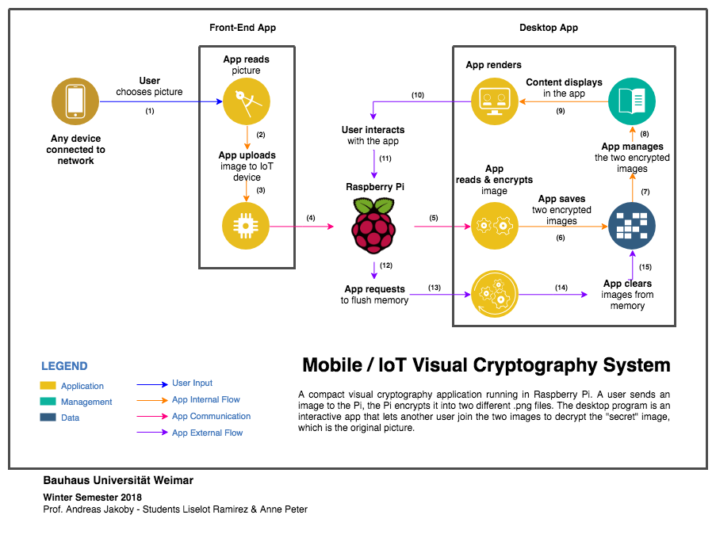

# viscrypto_iot
Visual Cryptography with Raspberry Pi 2

## Content

- [viscrypto_iot](#viscryptoiot)
  - [Content](#content)
    - [System](#system)
      - [<u>Concept</u>](#uconceptu)
      - [<u>Motivation</u>](#umotivationu)
      - [<u>Requirements</u>](#urequirementsu)
      - [<u>Project Description</u>](#uproject-descriptionu)
      - [<u>Papers and other resources</u>](#upapers-and-other-resourcesu)
      - [<u>Description</u>](#udescriptionu)
    - [Files](#files)
      - [<u>viscrypto_core</u>](#uviscryptocoreu)
      - [<u>desktop_app</u>](#udesktopappu)
      - [<u>res</u>](#uresu)
      - [LaunchUI (for Vuido)](#launchui-for-vuido)

---
### System

#### <u>Concept</u>

> Visual Cryptography is a technique that allows information (images, text, diagrams …) to be encrypted using an encoding system that can be decrypted by the eyes.

(Extracted from [Data Genetics](http://www.datagenetics.com/blog/november32013/index.html))

#### <u>Motivation</u>

This project started in November 2018 in Bauhaus Universität-Weimar, led by Professor Andreas Jakoby and developed by Liselot Ramirez and Anne Peter.

The goal is to include the fun of IoT with the goods of Computer Science's concepts, in this case, cryptography. The interactive application aims to provoke interest to those new and interested in this field.

#### <u>Requirements</u>

1. Desktop or Mobile device
   1. Connect to the LAN IP Address where the web front-end app will appear
   2. Send the image via the web app
2. Raspberry Pi
   1. Python
   2. Web App
      1. Serve it over a Python server
   3. Desktop App
      1. Install the desktop version for the Raspberry (Linux)
      2. Open the app like any other system application
      3. Follow the steps in the desktop app

#### <u>Project Description</u>

Basically, a mobile user will send an image to the desktop application in the Raspberry Pi. The RaspPi will get the image and then encrypt it into two separate `.png` images. Later, using the desktop application in the Raspberry Pi, another user will put together the two encrypted images to reveal the original image, which was received from the mobile device.

You can use a mobile or desktop device, as long as the web app is running and both your device and Raspberry Pi are connected together via WiLAN.

#### <u>Papers and other resources</u>

| Document | Author | Source |
| --- | --- | --- |
| Visual cryptography for color images | Young-Chang Hou | [PDF](https://ac.els-cdn.com/S0031320302002583/1-s2.0-S0031320302002583-main.pdf?_tid=f351eeb4-8974-4a14-be36-9f9c4b034b75&acdnat=1544352772_90fec2587bcfc5f8120d768cd8ef9f06)
| Color visual cryptography schemes for black and white secret images | Roberto De Prisco, Alfredo De Santis | [PDF](https://ac.els-cdn.com/S0304397513006750/1-s2.0-S0304397513006750-main.pdf?_tid=4a4372ee-30fb-410a-b064-9620372c3b62&acdnat=1544352997_d82b69ef7eb22498fe3fcaa9e38533ad)
| Python Implementation of Visual Secret Sharing Schemes | Ruxandra Olimid | [Article](https://www.researchgate.net/publication/227487359_PYTHON_IMPLEMENTATION_OF_VISUAL_SECRET_SHARING_SCHEMES)

#### <u>Description</u>

---
### Files

#### <u>viscrypto_core</u>
This folder contains the core app for visual cryptography. The main program is made in python and the results are loaded in the front-end app (desktop or web).

**Documentation**. More about visual cryptography and the doc can be found [here](#).

#### <u>desktop_app</u>
This folder contains the desktop app to be installed in the Raspberry Pi. 

**Vuido** The app version made in Vuido. Pros: it's native and can compile for MacOS/Windows/Linux with their native styles. Cons: You cannot stylized anything (no css/scss allowed).

More about Vuido and the doc can be found [here](https://vuido.mimec.org/).

**Vue/Electron (electron-vue)** Same as Vuido: developed in Vue, compiled in Electron, and built for the three main OS (Mac/Windows/Linux).

More about electron-vue and the doc can be found [here](https://simulatedgreg.gitbooks.io/electron-vue/content/en/).

#### <u>res</u>

#### LaunchUI (for Vuido)

Here is the GUI compiler for the desktop application. With this app, you can make release for MacOS, Windows, and Linux. I (ZeroLiam/Lis) use MacOS, so the file here for now is the GUI that works in Mac; however, if you use any other OS feel free to go to the [LaunchUI releases](https://github.com/mimecorg/launchui-packager-gui/releases) and download the one that suits you.